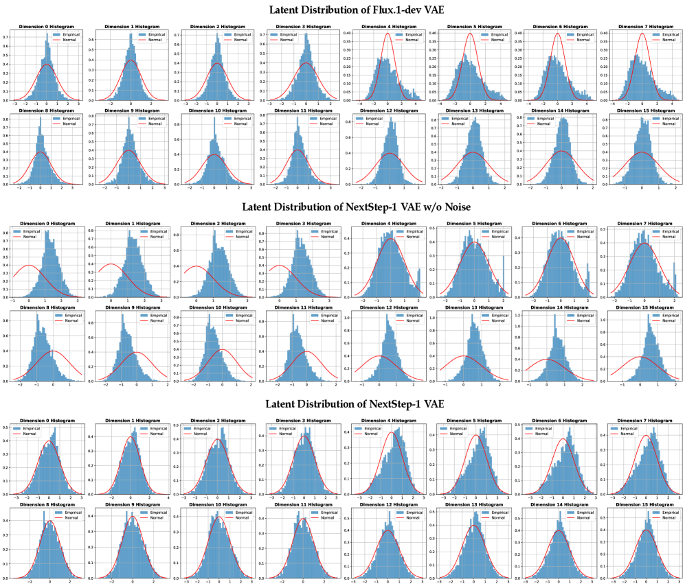
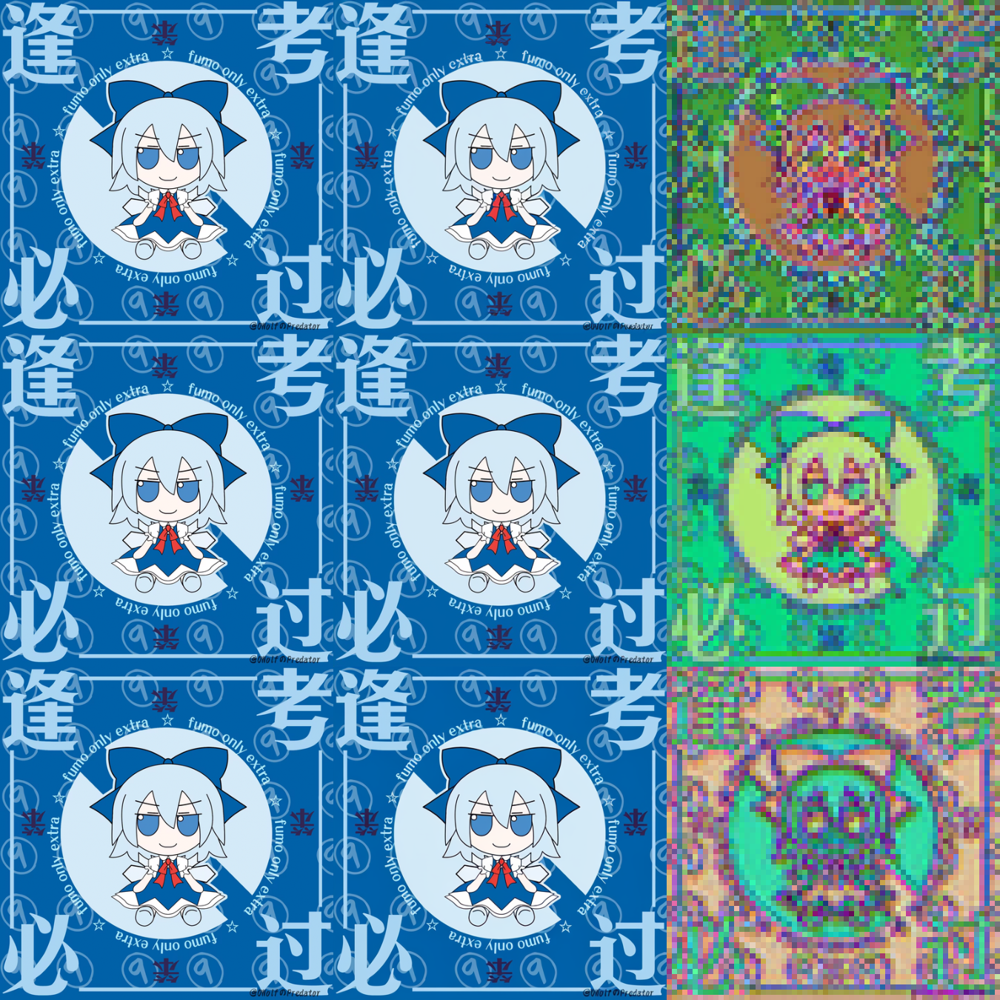

# AutoencoderKL

This repository is a branch of [lavinal712/AutoencoderKL](https://github.com/lavinal712/AutoencoderKL) with some modifications for the NextStep-1 VAE.

## Sigma-VAE

Sigma-VAE is proposed by [Multimodal Latent Language Modeling with Next-Token Diffusion](https://arxiv.org/abs/2412.08635) to prevent variance collapse by enforcing a fixed variance in the latent space. The reconstruction pass is computed as:

```math
\begin{aligned}
\mu &= \text{Encoder}_\phi(x) \\
z &= \mu + \sigma \odot \epsilon, \quad \text{where } \epsilon \sim \mathcal{N}(0,1),\ \sigma \sim \mathcal{N}(0,C_\sigma) \\
\hat{x} &= \text{Decoder}_\psi(z)
\end{aligned}
```

In [NextStep-1: Toward Autoregressive Image Generation with Continuous Tokens at Scale](https://arxiv.org/abs/2508.10711), they find that **a regularized latent space is critical for generation**. Specifically, applying higher noise intensity during tokenizer training increases generation loss but paradoxically improves the quality of the generated images. They attribute this phenomenon to noise regularization, cultivating a well-conditioned latent space. This process enhances two key properties: the tokenizer decoder’s robustness to latent perturbations and a more dispersed latent distribution, a property prior work has also found beneficial for generation.



## Visualization

This is the visualization of AutoencoderKL. From left to right, there are the original image, the reconstructed image and the visualizations of the latent space. From top to bottom, there are the results of SDXL VAE, FLUX VAE and NextStep-1 VAE.

The latent space of SDXL contains a lot of noise, while the noise is significantly reduced in FLUX and NextStep-1.



| Model          | rFID  | PSNR   | SSIM  | LPIPS |
| -------------- | ----- | ------ | ----- | ----- |
| sdxl-vae       | 0.665 | 27.376 | 0.794 | 0.122 |
| flux-vae       | 0.165 | 32.871 | 0.924 | 0.045 |
| NextStep-1 VAE | 1.201 | 30.160 | 0.883 | 0.061 |

## Acknowledgments

Thank NextStep-1 for providing the open-source code and model weights.

- [stepfun-ai/NextStep-1](https://github.com/stepfun-ai/NextStep-1). 
