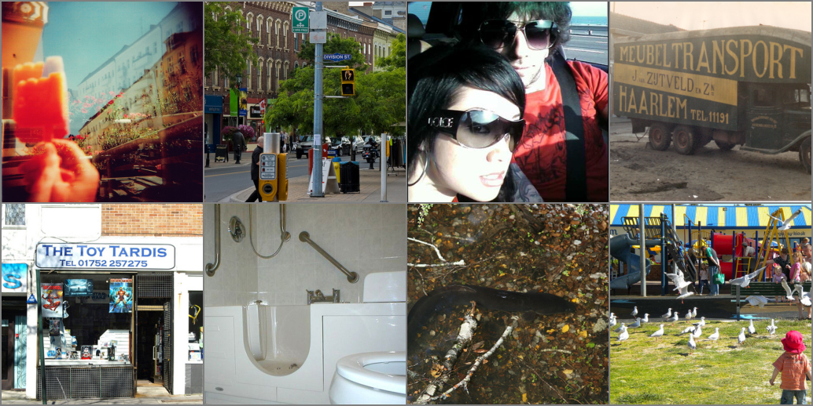
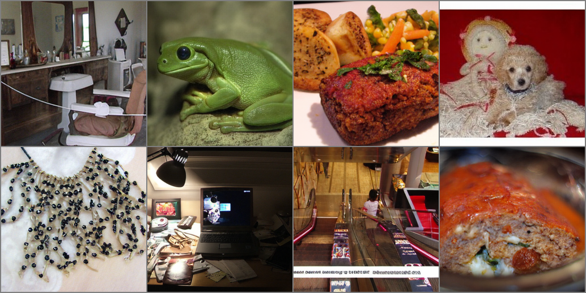

# Transfusion VAE

This repository is a branch of [lavinal712/AutoencoderKL](https://github.com/lavinal712/AutoencoderKL) with some modifications for the Transfusion VAE.

In paper [Transfusion](https://arxiv.org/abs/2408.11039), the authors proposed a new VAE for image generation. Different from the original VAE, the Transfusion VAE has 8 latent dimensions, and the training loss is:

```math
\mathcal{L}_{\text{VAE}} = \mathcal{L}_{1} + \mathcal{L}_{\text{LPIPS}} + 0.5 \mathcal{L}_{\text{GAN}} + 0.2 \mathcal{L}_{\text{ID}} + 0.000001 \mathcal{L}_{\text{KL}}
```

where $`\mathcal{L}_{1}`$ is the L1 loss, $`\mathcal{L}_{\text{LPIPS}}`$ is the perceptual loss based on LPIPS similarity, $`\mathcal{L}_{\text{GAN}}`$ is a patch-based discriminator loss, $`\mathcal{L}_{\text{ID}}`$ is a perceptual loss based on Moco v2 model, and $`\mathcal{L}_{\text{KL}}`$ is the standard KL-regularization loss.

## Visualization

| Input                                   | Reconstruction                                            |
|---------------------------------------  |-----------------------------------------------------------|
|  |  |

## Getting Started

### Installation

```
git clone https://github.com/lavinal712/AutoencoderKL.git -b transfusion_vae
cd AutoencoderKL
conda create -n autoencoderkl python=3.10 -y
conda activate autoencoderkl
pip install -r requirements.txt
```

### Model

You can load the pretrained model from [lavinal712/transfusion-vae](https://huggingface.co/lavinal712/transfusion-vae).

```python
from diffusers import AutoencoderKL

vae = AutoencoderKL.from_pretrained("lavinal712/transfusion-vae")
```

### Data

We use combined dataset of ImageNet, COCO and FFHQ for training. Here is the structure of data:

```
ImageNet/
├── train/
│   ├── n01440764/
│   │   ├── n01440764_18.JPEG
│   │   ├── n01440764_36.JPEG
│   │   └── ...
│   ├── n01443537/
│   │   ├── n01443537_2.JPEG
│   │   ├── n01443537_16.JPEG
│   │   └── ...
│   ├── ...
├── val/
│   ├── n01440764/
│   │   ├── ILSVRC2012_val_00000293.JPEG
│   │   ├── ILSVRC2012_val_00002138.JPEG
│   │   └── ...
│   ├── n01443537/
│   │   ├── ILSVRC2012_val_00000236.JPEG
│   │   ├── ILSVRC2012_val_00000262.JPEG
│   │   └── ...
│   ├── ...
└── ...
```

```
COCO/
├── annotations/
│   ├── captions_train2017.json
│   ├── captions_val2017.json
│   ├── ...
├── test2017/
│   ├── 000000000001.jpg
│   ├── 000000000016.jpg
│   └── ...
├── train2017/
│   ├── 000000000009.jpg
│   ├── 000000000025.jpg
│   └── ...
├── val2017/
│   ├── 000000000139.jpg
│   ├── 000000000285.jpg
│   └── ...
└── ...
```

```
FFHQ/
├── images1024x1024/
│   ├── 00000/
│   │   ├── 00000.png
│   │   ├── 00001.png
│   │   └── ...
│   ├── 01000/
│   │   ├── 01000.png
│   │   ├── 01001.png
│   │   └── ...
│   ├── ...
│   ├── 69000/
│   │   ├── 69000.png
│   │   ├── 69001.png
│   │   └── ...
│   └── LICENSE.txt
├── ffhq-dataset-v2.json
└── ...
```

### Training

We train the Transfusion VAE on combined dataset of ImageNet, COCO and FFHQ for 50 epochs.

```bash
torchrun --nproc_per_node=4 --nnodes=1 main.py \
    --base configs/transfusion_vae_32x32x8.yaml \
    --train \
    --scale_lr False \
    --wandb True \
```

### Evaluation

We evaluate the Transfusion VAE on ImageNet and COCO.

ImageNet 2012 (256x256, val, 50000 images)

| Model           | rFID  | PSNR   | SSIM  | LPIPS |
|-----------------|-------|--------|-------|-------|
| Transfusion-VAE | 0.408 | 28.723 | 0.845 | 0.081 |
| SD-VAE          | 0.692 | 26.910 | 0.772 | 0.130 |

COCO 2017 (256x256, val, 5000 images)

| Model           | rFID  | PSNR   | SSIM  | LPIPS |
|-----------------|-------|--------|-------|-------|
| Transfusion-VAE | 2.749 | 28.556 | 0.855 | 0.078 |
| SD-VAE          | 4.246 | 26.622 | 0.784 | 0.127 |

## Acknowledgements

Thanks to the following repositories for providing the code and models of Moco v2 and Moco v3, and a repository for the inspiration of the perceptual loss.

- [facebookresearch/moco](https://github.com/facebookresearch/moco)
- [facebookresearch/moco-v3](https://github.com/facebookresearch/moco-v3)
- [sypsyp97/convnext_perceptual_loss](https://github.com/sypsyp97/convnext_perceptual_loss)
