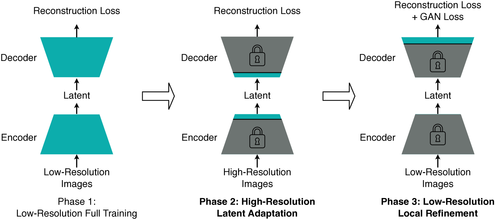

# Deep Compression Autoencoder

This repository is a branch of [lavinal712/AutoencoderKL](https://github.com/lavinal712/AutoencoderKL) with some modifications for the DC-AE. This code aims to provide a simple and easy-to-use training script regarding to [issue #173](https://github.com/mit-han-lab/efficientvit/issues/173).

We provide three different parameter configurations corresponding to the three phases of DC-AE training.

```
configs/
├── dc-ae-f32c32-in-1.0_phase1.yaml
├── dc-ae-f32c32-in-1.0_phase2.yaml
└── dc-ae-f32c32-in-1.0_phase3.yaml
```



## Visualization

Model: [mit-han-lab/dc-ae-f32c32-in-1.0](https://huggingface.co/models?other=dc-ae-f32c32-in-1.0)

| Input                                   | Reconstruction                                            |
|---------------------------------------  |-----------------------------------------------------------|
|  |  |

Evaluation (from [original paper](https://arxiv.org/abs/2410.10733))

| Model          | rFID | PSNR  | SSIM | LPIPS |
|----------------|------|-------|------|-------|
| DC-AE (f32c32) | 0.69 | 23.85 | 0.66 | 0.082 |
| SD-VAE         | 0.69 | 26.91 | 0.77 | 0.130 |

## Getting Started

### Installation

```
git clone https://github.com/lavinal712/AutoencoderKL.git -b dc-ae
cd AutoencoderKL
conda create -n autoencoderkl python=3.10 -y
conda activate autoencoderkl
pip install -r requirements.txt
```

### Data

We use the ImageNet dataset for training and validation.

```
ImageNet/
├── train/
│   ├── n01440764/
│   │   ├── n01440764_18.JPEG
│   │   ├── n01440764_36.JPEG
│   │   └── ...
│   ├── n01443537/
│   │   ├── n01443537_2.JPEG
│   │   ├── n01443537_16.JPEG
│   │   └── ...
│   ├── ...
├── val/
│   ├── n01440764/
│   │   ├── ILSVRC2012_val_00000293.JPEG
│   │   ├── ILSVRC2012_val_00002138.JPEG
│   │   └── ...
│   ├── n01443537/
│   │   ├── ILSVRC2012_val_00000236.JPEG
│   │   ├── ILSVRC2012_val_00000262.JPEG
│   │   └── ...
│   ├── ...
└── ...
```

### Training

```bash
torchrun --nproc_per_node=4 --nnodes=1 main.py \
    --base configs/dc-ae-f32c32-in-1.0_phase1.yaml \
    --train \
    --scale_lr False \
    --wandb True \
```

Remember to specify the model checkpoint path in the next phases in the command line or in the config file.

```bash
torchrun --nproc_per_node=4 --nnodes=1 main.py \
    --base configs/dc-ae-f32c32-in-1.0_phase2.yaml \
    --train \
    --scale_lr False \
    --wandb True \
    --resume_from_checkpoint /path/to/last.ckpt
```

```bash
torchrun --nproc_per_node=4 --nnodes=1 main.py \
    --base configs/dc-ae-f32c32-in-1.0_phase3.yaml \
    --train \
    --scale_lr False \
    --wandb True \
    --resume_from_checkpoint /path/to/last.ckpt
```

## Acknowledgements

Thanks for the original introduction and implementation of [DC-AE](https://github.com/mit-han-lab/efficientvit) .

- [mit-han-lab/efficientvit](https://github.com/mit-han-lab/efficientvit)
